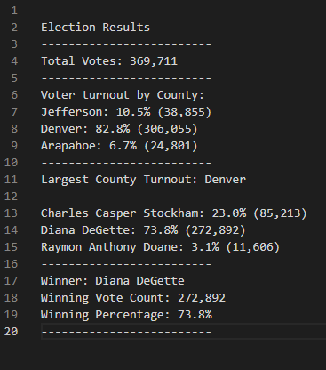

# Election_Analysis

## Election Overview
A Colorado Board of Elections employee have given us the following tasks to complete the election audit of a recent local congressional election. 
They need an efficient and quick way to count all the votes cast in the lection and determine the winner, while also showing who was running and what counties the votes were being placed. The tasks need are listed below.

1. Calculate total number of votes cast.
2. Get a complete list of counties involved in the election.
3. Calculate the total number of voters from each county.
4. Calulate the percentage of total votes cast by each county.
5. Determine the county with the most votes cast. 
6. Get a complete list of candidates who recieved votes. 
7. Calculate the total number of votes each candidate recieved. 
8. Calculate the percentage of votes each candidate won. 
9. Determine the winner of the election based on popular vote. 

# Resources 
- Data source: election_results.csv
- Software: Python 3.7.6, Visual Code Studio 1.64.2

# Election-Audit Results 
The analysis of the election show that:
- There were 369,711 votes cast in the election. 
- The voter turnout by county:
  - Jefferson county had a total of 38,855 votes cast which was 10.5% of the total vote.
  - Denver county had a total of 306,055 votes cast, which was 82.8% of the total vote.
  - Arapahoe county had a total of 24,801 votes cast, which was 6.7% of the total vote. 
- The county with the largest voter turnout was Denver county, which recieved 82.8% of the vote and 306,055 total votes.
- The candidates were:
  - Charles Casper Stockham
  - Diana DeGette
  - Raymon Anthony Doane
- The Candidate Results were:
  - Charles Casper Stockham recieved 23.0% of the vote and 85,213 votes.
  - Diana DeGette recieved 73.8% of the vote and 272,892 votes.
  - Raymon Anthony Doane recieved 3.1% of the vote and 11,606 votes.
- The winner of the election was:
  - Diane DeGette, who recieved 73.8% of the vote and 272,892 of the total votes.

After running the code the results were displayed on a text file shown below. 

# Election-Audit Summary
I believe this script can be use to count serve 
